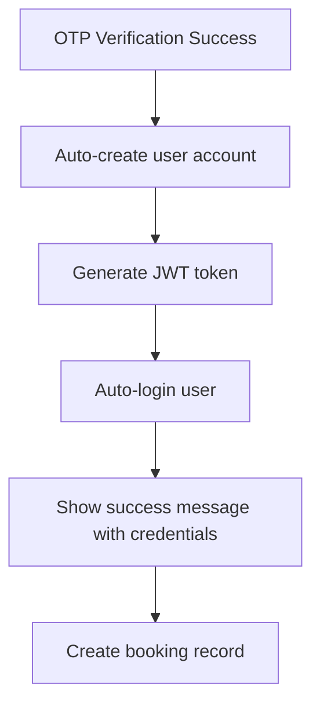
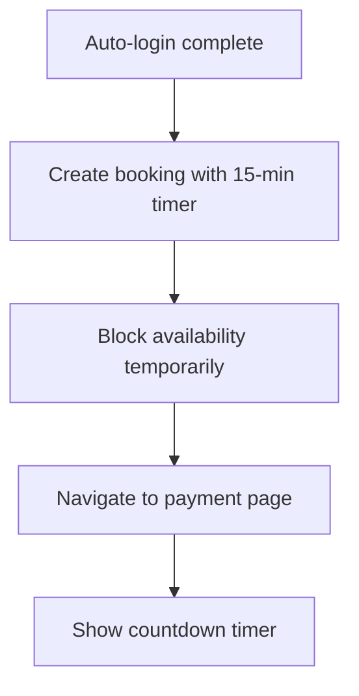
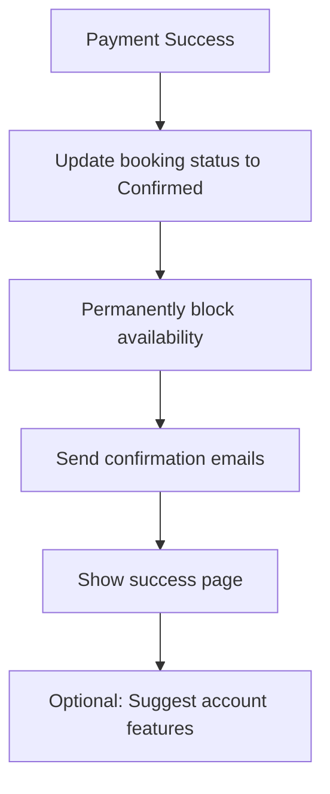

# Guest Booking Flow Documentation

## Overview

This document describes the complete guest booking process for Wezo.ae, implementing a professional booking flow with automatic account creation and soft hold system to prevent double bookings.

## 📋 System Requirements

- **No Authentication Required**: Guests can book without creating accounts upfront
- **Auto-Account Creation**: System creates accounts automatically after email verification
- **Soft Hold**: Properties are held temporarily during payment process
- **Optional Rate Plans**: Guests can book with or without rate plans
- **Professional UX**: Industry-standard booking experience

## 🎯 Target User Journey

**Primary User**: Anonymous guest who wants to book a property without creating an account first.

**Key Goals**:
- Complete booking with minimal friction
- Feel confident the property is secured during payment
- Receive account automatically for future bookings
- Professional, trustworthy booking experience

## 🔄 Complete Booking Flow

### **Phase 1: Property Discovery & Selection**

```mermaid
graph TD
    A[Guest visits property page] --> B[Select dates & guests]
    B --> C[Choose rate plan or direct booking]
    C --> D[Click "Book Now"]
    D --> E[Navigate to BookingConfirmation]
```

**Status**: Public access, no authentication required

### **Phase 2: Guest Information Collection**

```mermaid
graph TD
    A[BookingConfirmation Page] --> B[Enter guest name & email]
    B --> C[Click "Send Verification Code"]
    C --> D[Server sends OTP: 123456]
    D --> E[Guest enters OTP: 123456]
```

**API Endpoints**:
- `POST /api/booking/send-otp` - Sends OTP (hardcoded "123456" for development)
- `POST /api/booking/verify-otp` - Verifies OTP and creates account

**Development Setup**:
- **OTP**: Always "123456" (no email service needed)
- **Auto-Password**: Always "123456" (displayed in success message)

### **Phase 3: Auto-Account Creation & Authentication**



**Account Creation Process**:
```typescript
// Server-side auto-account creation
const user = await prisma.user.create({
  data: {
    username: email.split('@')[0],
    email: email,
    password: await bcrypt.hash('123456', 10), // Development password
    role: 'Tenant'
  }
})

// Generate JWT for auto-login
const token = jwt.sign({ id, username, email, role }, JWT_SECRET, { expiresIn: '7d' })
```

**Client-side auto-login**:
```typescript
// Dispatch auto-login action
dispatch(autoLogin({ user: response.user, token: response.token }))

// Show credentials to user
addToast('Account created! Email: ' + email + ' | Password: 123456')
```

### **Phase 4: Soft Hold Booking Creation**



**Booking Creation**:
```typescript
const reservation = await prisma.reservation.create({
  data: {
    ratePlanId: ratePlanId || null, // Optional
    propertyId: propertyId,
    guestId: user.id,
    checkInDate: new Date(checkInDate),
    checkOutDate: new Date(checkOutDate),
    numGuests: numGuests,
    totalPrice: parseFloat(totalPrice),
    status: 'Pending',
    paymentStatus: 'Pending',
    expiresAt: new Date(Date.now() + 15 * 60 * 1000), // 15 minutes from now
    guestRequests: specialRequests || null
  }
})
```

**Availability Blocking**:
```typescript
// Block dates temporarily
for (const date of bookingDates) {
  await prisma.availability.upsert({
    where: { propertyId_date: { propertyId, date } },
    update: { 
      isAvailable: false,
      reservationId: booking.id,
      holdExpiresAt: booking.expiresAt
    },
    create: { 
      propertyId, 
      date, 
      isAvailable: false,
      reservationId: booking.id,
      holdExpiresAt: booking.expiresAt
    }
  })
}
```

### **Phase 5: Payment with Countdown Timer**

```mermaid
graph TD
    A[Payment page loads] --> B[Show 15-minute countdown]
    B --> C[User selects payment method]
    C --> D[Click "Pay Now"]
    D --> E{Timer still valid?}
    E -->|Yes| F[Process payment]
    E -->|No| G[Show "Booking expired"]
    F --> H{Payment success?}
    H -->|Yes| I[Confirm booking]
    H -->|No| J[Keep booking pending]
```

**Timer Implementation**:
```typescript
// Client-side countdown
const [timeLeft, setTimeLeft] = useState(15 * 60) // 15 minutes in seconds

useEffect(() => {
  const interval = setInterval(() => {
    setTimeLeft(prev => {
      if (prev <= 1) {
        // Booking expired
        navigateTo('booking-expired')
        return 0
      }
      return prev - 1
    })
  }, 1000)
  
  return () => clearInterval(interval)
}, [])
```

**Payment Processing**:
```typescript
// Check if booking is still valid
if (booking.expiresAt < new Date()) {
  return res.status(400).json({ message: 'Booking has expired' })
}

// Process payment (mock for development)
if (paymentSuccess) {
  await prisma.reservation.update({
    where: { id: bookingId },
    data: {
      status: 'Confirmed',
      paymentStatus: 'Paid',
      expiresAt: null // Remove expiry
    }
  })
  
  // Permanently block availability
  await updateAvailabilityToPermanent(bookingId)
}
```

### **Phase 6: Booking Confirmation & Cleanup**



## 🗂️ Database Schema

### **Enhanced Reservation Model**
```prisma
model Reservation {
  id            String   @id @default(cuid())
  ratePlanId    String?  // Optional for direct bookings
  propertyId    String   // Direct property reference
  guestId       String
  checkInDate   DateTime
  checkOutDate  DateTime
  numGuests     Int
  totalPrice    Float
  status        String   // 'Pending', 'Confirmed', 'Cancelled', 'Expired'
  paymentStatus String   // 'Pending', 'Paid', 'Failed', 'Cancelled'
  expiresAt     DateTime? // When booking expires if unpaid
  guestRequests String?
  createdAt     DateTime @default(now())
  updatedAt     DateTime @updatedAt
  
  // Relations
  ratePlan      RatePlan? @relation(fields: [ratePlanId], references: [id])
  property      Property  @relation(fields: [propertyId], references: [propertyId])
  guest         User      @relation(fields: [guestId], references: [id])
}
```

### **Enhanced Availability Model**
```prisma
model Availability {
  propertyId     String
  date          DateTime
  isAvailable   Boolean  @default(true)
  reservationId String?  // Link to reservation holding the date
  holdExpiresAt DateTime? // When temporary hold expires
  
  @@id([propertyId, date])
  @@map("availability")
}
```

## 🔄 Background Jobs

### **Expired Booking Cleanup Service**

```typescript
// Run every minute to clean up expired bookings
export class BookingCleanupService {
  async cleanupExpiredBookings() {
    const expiredBookings = await prisma.reservation.findMany({
      where: {
        status: 'Pending',
        expiresAt: { lt: new Date() }
      }
    })
    
    for (const booking of expiredBookings) {
      // Update booking status
      await prisma.reservation.update({
        where: { id: booking.id },
        data: { 
          status: 'Expired',
          paymentStatus: 'Cancelled'
        }
      })
      
      // Release availability
      await this.releaseAvailability(booking.id)
      
      // Optional: Send "booking expired" email
      await this.sendExpiryNotification(booking)
    }
  }
  
  private async releaseAvailability(bookingId: string) {
    await prisma.availability.updateMany({
      where: { reservationId: bookingId },
      data: { 
        isAvailable: true,
        reservationId: null,
        holdExpiresAt: null
      }
    })
  }
}

// Schedule to run every minute
setInterval(() => {
  new BookingCleanupService().cleanupExpiredBookings()
}, 60000)
```

## 📱 UI Components

### **Countdown Timer Component**
```typescript
const BookingTimer: React.FC<{ expiresAt: string }> = ({ expiresAt }) => {
  const [timeLeft, setTimeLeft] = useState(calculateTimeLeft(expiresAt))
  
  const formatTime = (seconds: number) => {
    const mins = Math.floor(seconds / 60)
    const secs = seconds % 60
    return `${mins}:${secs.toString().padStart(2, '0')}`
  }
  
  return (
    <Box backgroundColor="#fef2f2" padding="1rem" borderRadius="8px" marginBottom="2rem">
      <Box display="flex" alignItems="center" gap="0.5rem" marginBottom="0.5rem">
        <IoTime color="#dc2626" />
        <Box fontWeight="600" color="#dc2626">
          Complete payment within: {formatTime(timeLeft)}
        </Box>
      </Box>
      <Box fontSize="0.875rem" color="#b91c1c">
        🔒 We're holding this property for you. Don't lose your booking!
      </Box>
    </Box>
  )
}
```

### **Success Message Component**
```typescript
const AutoAccountSuccess: React.FC<{ email: string }> = ({ email }) => (
  <Toast type="success" autoHide={false} duration={10000}>
    <Box>
      <Box fontWeight="600" marginBottom="0.5rem">Account Created Successfully!</Box>
      <Box fontSize="0.875rem">
        📧 Email: {email}<br/>
        🔑 Password: 123456<br/>
        💡 You can login anytime with these credentials
      </Box>
    </Box>
  </Toast>
)
```

## 🚨 Error Handling

### **Common Error Scenarios**

1. **OTP Verification Failed**
   ```
   Message: "Invalid OTP code. Please try again."
   Action: Allow retry with same email
   ```

2. **Property No Longer Available**
   ```
   Message: "Sorry, this property is no longer available for your selected dates."
   Action: Redirect to property search with same criteria
   ```

3. **Booking Creation Failed**
   ```
   Message: "Unable to create booking. Please try again."
   Action: Return to guest details step
   ```

4. **Payment Processing Failed**
   ```
   Message: "Payment failed. Your booking is still held for X minutes."
   Action: Allow retry payment with same booking
   ```

5. **Booking Expired During Payment**
   ```
   Message: "Your booking has expired. Please start over to check availability."
   Action: Clear booking state, redirect to property page
   ```

## 📈 Analytics & Monitoring

### **Key Metrics to Track**

1. **Conversion Rates**:
   - Property view → Book Now clicks
   - Guest details → OTP verification
   - OTP verification → Payment page
   - Payment page → Completed booking

2. **Timing Metrics**:
   - Average time from OTP to payment
   - Booking expiry rates (should be <5%)
   - Payment completion rates within timer

3. **Error Rates**:
   - OTP verification failures
   - Payment processing failures
   - Booking expiry incidents

### **Success KPIs**
- **Target Conversion**: >85% from OTP verification to payment
- **Target Completion**: >90% complete payment within timer
- **Target Expiry**: <5% of bookings expire

## 🔐 Security Considerations

1. **Rate Limiting**: Limit OTP requests per email (max 3 per hour)
2. **Booking Validation**: Re-verify availability before payment
3. **Token Security**: JWT tokens expire in 7 days
4. **Data Protection**: Hash all passwords, sanitize inputs
5. **Audit Logging**: Log all booking state changes

## 🚀 Future Enhancements

1. **Dynamic Timer**: Adjust hold duration based on property demand
2. **Email Service**: Replace console logging with real email delivery
3. **SMS OTP**: Offer SMS verification as alternative
4. **Payment Methods**: Add multiple payment gateways
5. **Mobile App**: Extend flow to mobile application
6. **Social Login**: Add Google/Facebook login options

## 📞 Support Scenarios

### **Common User Questions**

1. **"I didn't receive the OTP"**
   - Check spam folder
   - For development: OTP is always "123456"
   - Offer resend option

2. **"My booking expired during payment"**
   - Apologize for inconvenience
   - Check if property still available
   - Offer to restart booking process

3. **"I forgot my password"**
   - Development password is always "123456"
   - Production: Implement password reset flow

4. **"Can I modify my booking?"**
   - Direct to booking management system
   - Explain modification/cancellation policies

This documentation provides the complete technical and business context for the guest booking flow implementation.